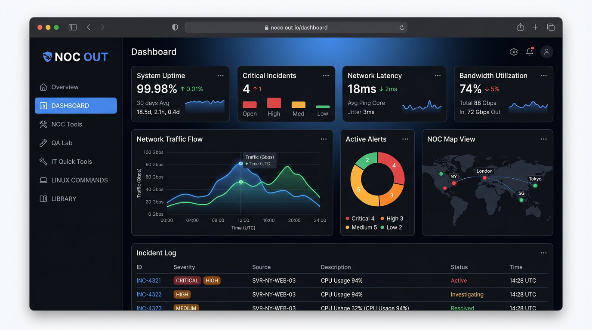
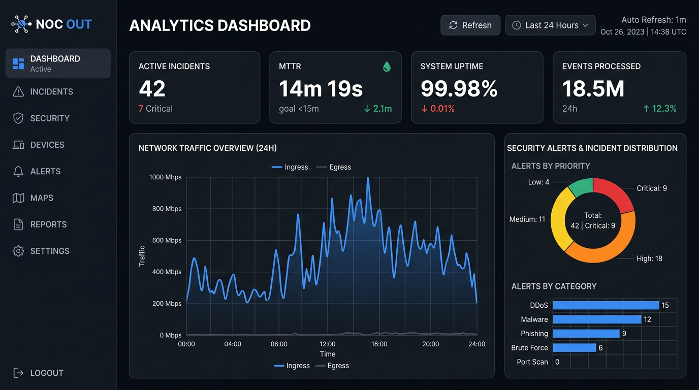
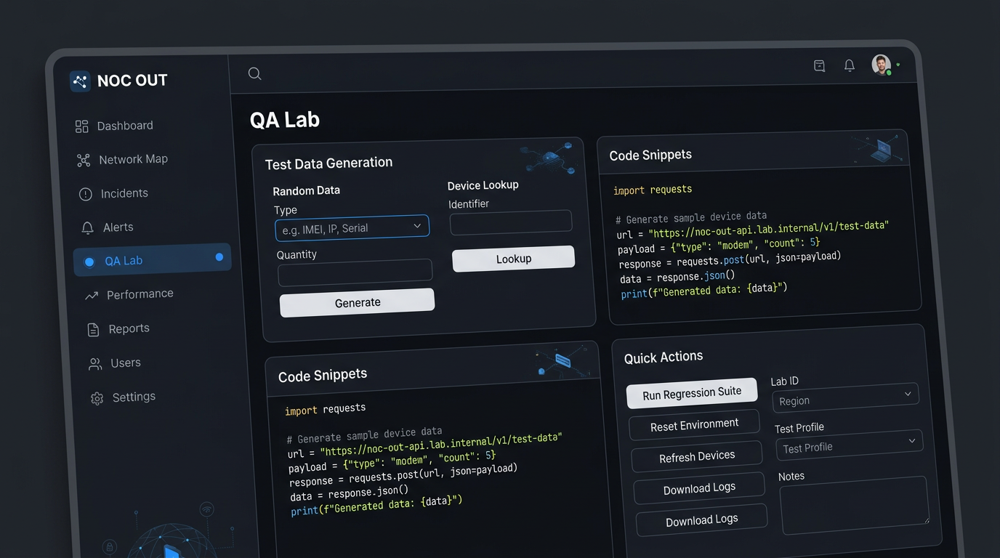

# NOC OUT — ESS HIT

A NOC/SOC-style operations dashboard: static web UI (HTML/CSS/JS) with a **FastAPI** backend and **PostgreSQL**. Built for demos and development, including QA helpers for synthetic test data, a live IP reputation scanner, and an AI-powered incident response simulator.

## Screenshots

*Representative UI previews for the README. You can replace these files under `screenshots/` with your own captures anytime.*

### Overview



### Dashboard



### QA Lab



---

## Stack

| Layer | Details |
|--------|---------|
| **Frontend** | `frontend/` — static SPA served by **Nginx**; `/api/...` is reverse-proxied to the backend. |
| **Backend** | `backend/` — **FastAPI**, **SQLModel**, **Uvicorn**; retries DB connection on startup. |
| **Database** | **PostgreSQL 15** in Docker; tables created on startup (`SQLModel.metadata.create_all`). |
| **IP Reputation** | **AbuseIPDB API** — server-side proxy keeps the API key off the client. |
| **AI Simulator** | **Google Gemini API** (`google-generativeai`) — dynamic model resolution at runtime. |

## Requirements

- [Docker Desktop](https://www.docker.com/products/docker-desktop/) (or Docker Engine + Docker Compose plugin)
- API keys for the features you want to use (see [Environment](#environment) below)

## Quick start

From the project root:

```bash
docker compose up --build
```

When services are healthy:

- **Web UI:** [http://localhost](http://localhost) (port 80)
- **API (direct):** [http://localhost:8000](http://localhost:8000) — interactive docs: [http://localhost:8000/docs](http://localhost:8000/docs)

Stop with `Ctrl+C` or `docker compose down`. Database files live in the Docker volume `postgres_data` until you remove it (`docker compose down -v`).

## Default ports

| Service | Host port |
|---------|-----------|
| Frontend (Nginx) | 80 |
| Backend (Uvicorn) | 8000 |
| PostgreSQL | 5432 |

## Environment

Copy `.env.example` to `.env` and fill in your API keys before starting:

```bash
cp .env.example .env
```

| Variable | Required for | Where to get it |
|----------|-------------|-----------------|
| `ABUSEIPDB_API_KEY` | IP Reputation Scanner | [abuseipdb.com/account/api](https://www.abuseipdb.com/account/api) |
| `GEMINI_API_KEY` | NOC AI Simulator | [aistudio.google.com/app/apikey](https://aistudio.google.com/app/apikey) |

`compose.yaml` loads `.env` into the backend container automatically (`env_file: .env`, `required: false` — the app starts fine without it, features that need a key return a clear 503).

`compose.yaml` also sets `DATABASE_URL` inline. For local runs outside Docker, set the same variable to your Postgres connection string.

> **Security:** default credentials in Compose are for **local development only**. Do not commit `.env` or production passwords to GitHub.

## Features

### IP Reputation Scanner (`backend/api/ip_reputation.py`)

Sidebar item: **🔎 IP Scanner**

Accepts an IPv4 or IPv6 address, validates it server-side with Python's `ipaddress` stdlib, and proxies a request to the [AbuseIPDB v2 `check` endpoint](https://docs.abuseipdb.com/#check-endpoint). The API key never reaches the browser.

The response is displayed as a colour-coded abuse confidence score (green → red, 0–100) alongside a details grid: ISP, domain, country, usage type, total reports, last reported date, and whitelist status. Each scan is persisted to the `IPInvestigation` table in PostgreSQL and stored in `localStorage` for a recent-scans history.

**API endpoint:** `GET /api/ip/scan?ip=<address>`

### NOC AI Simulator (`backend/api/simulator.py`)

Sidebar item: **🤖 AI Simulator**

An interactive incident-response training module. On each drill the backend asks Gemini to generate a randomised NOC/SOC scenario (server outage, DB lock contention, DDoS, disk exhaustion, etc.). The user types their mitigation plan; Gemini evaluates it and returns a structured score out of 100 with strengths, gaps, and recommendations.

Sessions are held in-memory on the backend — no database required. The frontend maintains session state via a UUID returned on `/start` and sent with each `/respond` call.

**API endpoints:**

| Method | Path | Description |
|--------|------|-------------|
| POST | `/api/simulator/start` | Start a new drill; returns `session_id` and the opening scenario. |
| POST | `/api/simulator/respond` | Submit mitigation steps; returns AI evaluation with score. |
| DELETE | `/api/simulator/session/{id}` | Explicitly free a session from memory. |

#### Dynamic model resolution & self-healing

Rather than hardcoding a model name, the backend calls `genai.list_models()` on the first request after startup, filters for models that have `"flash"` in the name and support `generateContent`, prefers non-preview entries for stability, and caches the result. All subsequent requests use the cached name — `list_models()` is not called again.

If a cached model is deprecated mid-session and the Gemini API returns a 404, `_gemini_http_exception()` detects it, clears the cache, and returns a clean HTTP 503 to the client. The next request automatically re-runs discovery and picks whichever flash model is currently available — no code change or restart required.

## API (full list)

| Method | Path | Description |
|--------|------|-------------|
| GET | `/api/qa/advanced-random` | Synthetic bundle: person, addresses, phones, device profile. |
| GET | `/api/qa/device-lookup?q=...` | Search the internal device catalog by name, codename, or model code. |
| GET | `/api/ip/scan?ip=...` | Query AbuseIPDB for IP reputation data; persists result to DB. |
| POST | `/api/simulator/start` | Start a new NOC drill; Gemini generates a scenario. |
| POST | `/api/simulator/respond` | Submit mitigation steps for AI evaluation and scoring. |
| DELETE | `/api/simulator/session/{id}` | End a simulator session. |

Models in `backend/models.py` (`Incident`, `RunLog`, `IPInvestigation`) define the data layer.

## Development

- **Backend:** `./backend` is mounted into the container and Uvicorn runs with `--reload` — Python changes apply without rebuilding the image.
- **Frontend:** static files are mounted into Nginx — refresh the browser after editing HTML/JS/CSS.
- **Rebuilding** is only needed when `requirements.txt` changes: `docker compose up --build`.

## Repository layout

```
ESS HIT/
├── compose.yaml
├── .env.example           # copy to .env and fill in API keys
├── README.md
├── CLAUDE.md              # guidance for Claude Code
├── screenshots/           # UI images for this README
├── backend/
│   ├── main.py            # FastAPI app entry point
│   ├── models.py          # SQLModel data models
│   ├── database.py        # engine + session dependency
│   ├── device_catalog.py  # static Android device lookup
│   └── api/
│       ├── ip_reputation.py   # AbuseIPDB integration
│       └── simulator.py       # Gemini AI simulator
└── frontend/
    ├── index.html         # shell + all CSS
    ├── app.js             # all page logic and API calls
    ├── qtt-extras.js      # IT Quick Tools panel
    ├── nginx.conf         # reverse proxy config
    └── Dockerfile
```

## License

No license file is included yet. Add a `LICENSE` if you publish the repository publicly.
